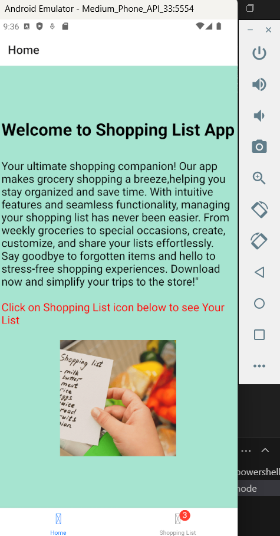
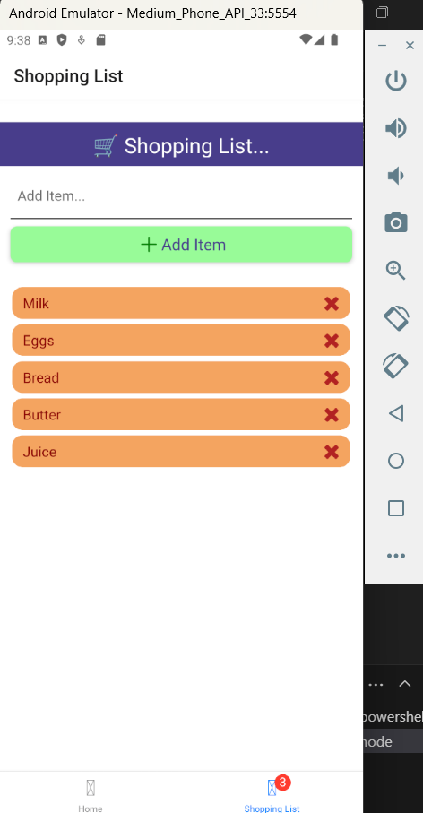
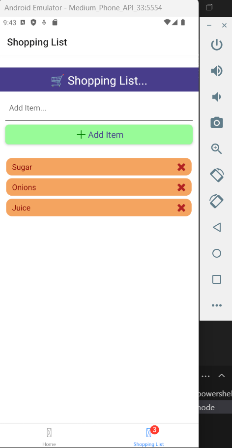

# Team members
Gautami Pannem (M15803105)
Narendra Reddy Peddireddy (M15804677)

# Introduction:
The goal of this app is simplicity and efficiency. The user interface is clean and user-friendly, allowing users to quickly add items they need to purchase, check them off as they shop, and remove them from the list if necessary. 

# Key Features

User-Friendly Interface

1.Utilized React Navigation for transitioning between different screens like the home Screen,and shopping list screen for  item addition.
2.Ensure all buttons, inputs, and list items are easily tappable on various screen sizes.

List Management

1.Users can quickly add new items and remove them from the list.

# App video description link:

https://mailuc-my.sharepoint.com/:v:/g/personal/pannemgi_mail_uc_edu/EfgaW826Co1Ftq9BZfgnrGgBrYThl2q2Souljyk2dlADEQ?e=8BQ1Jo

# App Images




# Getting Started

To run the app, simply run

```npm install && npx expo start```


